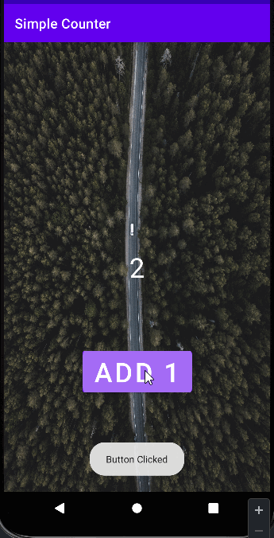

Codepath Spring 2023 Android 102 Unit 1 Lab

# *Simple Counter*

A simple **Counter** app, similar to popular idle tap mobile games. Idle tap games track the number of times a user has tapped on the screen, and allow users to accumulate points that can be exchanged for upgrades.

## User Stories

The following **required** functionality is completed:
- [:heavy_check_mark:] User can see a number displayed on the screen. The number starts at 0.
- [:heavy_check_mark:] User can tap on a button to see the number displayed increase by 1.

The following **optional** features are implemented:

The stretch features will help develop this app into something closer to an idle tap game.

- [:heavy_check_mark:] User can exchange number of taps accumulated for upgrades:
  - Ideas for possible upgrades:
    - [:heavy_check_mark:] User can exchange 100 taps for an upgrade where each tap will count as 2 taps
    - [] User can exchange 100 taps for an icon button instead of the standard one.
- [:heavy_check_mark:] Customize the app with a theme. For example, you can have a dog background and a paw print button to give your app a dog theme.
- [] (Extra challenge) User has increasingly difficult goals to reach in terms of number of taps accumulated. Each goal is displayed on the screen until the next goal is reached, and user can see how many goals they've reached in total.

## Video Walkthrough

Here's a walkthrough of implemented user stories:

GIF created with [LiceCap](http://www.cockos.com/licecap/).

## Open-source libraries used

- [Glide](https://github.com/bumptech/glide) - Image loading and caching library for Android

## License

    Copyright [yyyy] [name of copyright owner]

    Licensed under the Apache License, Version 2.0 (the "License");
    you may not use this file except in compliance with the License.
    You may obtain a copy of the License at

        http://www.apache.org/licenses/LICENSE-2.0

    Unless required by applicable law or agreed to in writing, software
    distributed under the License is distributed on an "AS IS" BASIS,
    WITHOUT WARRANTIES OR CONDITIONS OF ANY KIND, either express or implied.
    See the License for the specific language governing permissions and
    limitations under the License.
